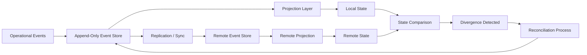

# Mike Holton

Operations & systems leader building distributed control platforms for multi-site environments where workflow, state, and financial outcomes must remain aligned.

Focused on systems where operational correctness, traceability, and reconciliation are non-negotiable.

## System Overview (Event Flow & Reconciliation)

This model illustrates how event sourcing, projection, and reconciliation interact to maintain consistent operational state across distributed sites.

## Featured Project

### [Distributed Ops Control Platform](https://github.com/mholton-ops/distributed-ops-control-platform)

Clean-room reference implementation of a distributed operations control platform, demonstrating:

- append-only event history
- deterministic projections
- site synchronization and replay
- divergence detection
- reconciliation workflows
- operator-facing internal tooling

## What I work on

- distributed operational systems
- workflow control and traceability
- event-driven state and projections
- replay, synchronization, and reconciliation
- systems tied to real operating conditions

## Links

- [HALDN](https://haldn.com)
- [LinkedIn](https://www.linkedin.com/in/mike-holton-4b876762/)
- [Distributed Ops Control Platform](https://github.com/mholton-ops/distributed-ops-control-platform)

## Note

This repository set is intended to demonstrate architecture, operational thinking, and clean-room public system design. It does not contain proprietary code, confidential business logic, customer data, or protected workflows.
